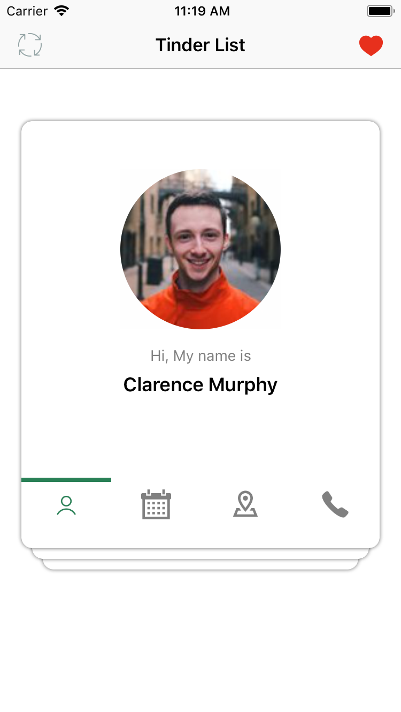
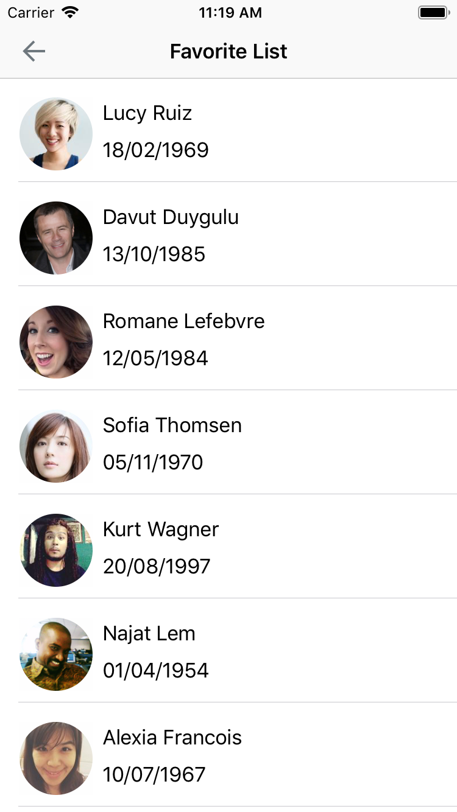

# Tinder App

This is an app that clone some main features of tinder 
## Screenshots
                                                                

## Features
1. Swipe left and right random people
2. Every card in the app has the details of person with person's image on top and icons on bottom, name and other info
3. If I swipe left I get the details of the next person
4. At the bottom there are multiple icons on touch the information changes
5. The user whom I swiped right should be stored as favourite
6. My favourite list of people should be available offline also

## Supports
- iOS 10.0+
- Xcode 12.0
- Swift 5

## Contributing
Pull requests are welcome. For major changes, please open an issue first to discuss what you would like to change.

Please make sure to update tests as appropriate.

## License
[Ho Si Luan](https://www.linkedin.com/in/hosiluan/)
